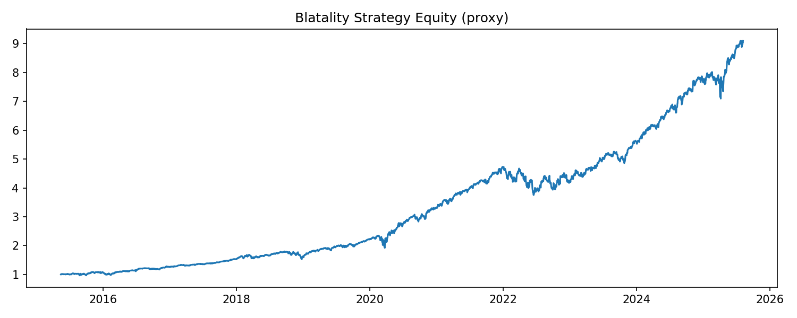

# 📊 Volatility Arbitrage: IV vs HV Divergence Strategy

A modular Python backtest for a volatility‐arbitrage strategy that trades straddles based on the gap between **implied volatility (IV)** and **historical volatility (HV)**. Built end-to-end with simulation, friction modeling, dynamic exits, parameter optimization, and realistic position‐sizing.

---

## 🎯 Strategy Overview

* **Sell straddle** when IV ≥ HV × *upper\_thresh* (mean‐reversion of vol).
* **Buy straddle** when IV ≤ HV × *lower\_thresh* (volatility breakout).
* **Exit** earliest of:

  * **Profit‐take** at *profit\_target\_pct* × premium
  * **Stop‐loss** at *stop\_loss\_pct* × premium
  * **Calendar exit** after *hold\_period* days
* **Simulated costs**:

  * Commission: *commission\_pct* round‑trip
  * Slippage: *slippage\_pct* per leg
* **Position‐size** scaled so annualized volatility ≈ 25%.

---

## 🚀 What’s in This Repo

```
vol_arbitrage_ivhv/
├── data/                   # NIFTY spot prices (CSV)
├── outputs/                # Charts & performance logs
│   ├── equity_curve.png    # Raw PnL
│   ├── equity_curve_scaled.png # Vol‐scaled PnL
│   ├── strategy_stats.txt  # Raw metrics
│   ├── strategy_stats_scaled.txt # Scaled metrics
│   └── param_grid_full.csv # Optimization results
├── utils/                  # Modular strategy components
│   ├── hv_calculator.py    # Historical vol
│   ├── iv_simulator.py     # Simulated IV engine
│   ├── strategy_rules.py   # Signal logic
│   ├── payoff_calculator.py# Straddle PnL + exits
│   └── performance_metrics.py # Metrics & ratios
├── main_backtest.py        # Full pipeline & optimization
├── requirements.txt        # Dependencies
└── README.md               # Project overview (you’re here!)
```

---

## 📈 Final Results (Mock NIFTY Data)

### Raw PnL Metrics (per unit)

```
Total Return          : 20,917.29
Annualized Return     : 142.68%  
Annualized Volatility : 71,849.63%  
Sharpe Ratio          : 2.94
Sortino Ratio         : 21.95
Max Drawdown          : 3,046.46
Calmar Ratio          : 0.05
Number of Trades      : 236
Win Rate              : 64.41%
```

### Scaled PnL Metrics (normalized to 25% ann. vol)

```
Total Return          : 72.86%   
Annualized Return     : 35.66%   
Annualized Volatility : 25.00%   
Sharpe Ratio          : 1.43
Sortino Ratio         : 1.07
Max Drawdown          : 10.45%   
Calmar Ratio          : 3.42
Number of Trades      : 236
Win Rate              : 64.41%
```




> **Key Parameters:**
>
> * `upper_thresh` = 1.1    
> * `lower_thresh` = 0.7    
> * `stop_loss_pct` = 1.0    
> * `profit_target_pct` = 0.05
> * `hold_period` = 5 days
> * `commission_pct` = 0.001 (0.1%)
> * `slippage_pct` = 0.0005 (0.05%)

---

## 🛠 How to Run

1. **Install**:

   ```bash
   pip install -r requirements.txt
   ```
2. **Backtest + Optimize**:

   ```bash
   python main_backtest.py
   ```
3. **Inspect**:

   * `outputs/equity_curve.png` (raw)
   * `outputs/equity_curve_scaled.png` (vol-scaled)
   * `outputs/strategy_stats.txt` & `strategy_stats_scaled.txt`
   * `outputs/param_grid_full.csv` for optimization grid

---

## 🔧 Future Improvements

* Pull real IV from NSE/Sensibull API
* Event‐driven filters (macro releases, earnings)
* Walk‐forward analysis to guard against overfit
* Live deployment with paper‐trading integration

---

*Built by Anmol Aggarwal — [guyfin215@gmail.com](mailto:guyfin2152gmail.com)*
